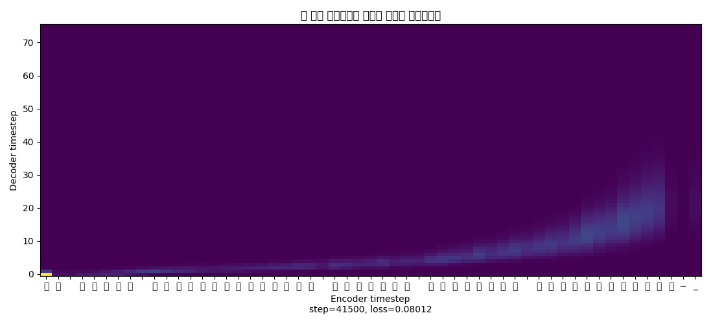

# tacotro: 음성합성

음성합성 엔진[(D.Voice)](https://github.com/sokcuri/multi-speaker-tacotron-tensorflow/blob/master/README_ko.md)을 받아서 학습시키고 있습니다.

유인나의 목소리로 1시간 정도의 데이터를 만들었는데 알아들을 수 있는 수준이 되려면 10시간 정도는 데이터가 필요할 것 같습니다.

